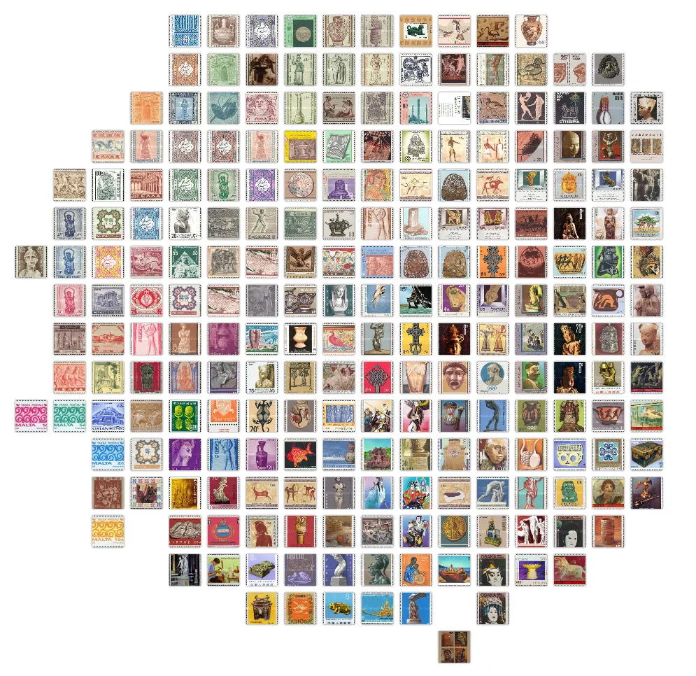
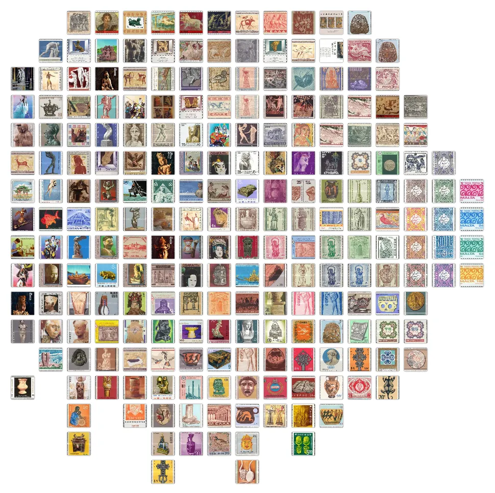

# assignment 3 image

category: school
completed: No
date: May 2, 2025
class: digital humanities

# Stamping Identity: Image Analysis of Stamps along the Silk Road

## Introduction

As someone who works in visual culture, I am very familiar with the traditional methods of visual analysis, which usually rely on close observation of formal properties. However concepts of ‘distant viewing’ bring a new way to think about visual media, one that also looks at mass amounts of images together. After reading the prompt, I felt a bit conflicted on what to focus on since in a way this assignment is perfect for me and my academic interests but that also made overwhelming. I eventually drew inspiration from iconography, which is a branch of art history that addresses identification, description and interpretation of the content of images. Icons are deeply connected with mass communication and I felt that there was a lot of potential for it to be studied with distant reading techniques. I decided to work on stamps, a common image with a very standardized angle/dimension, but which also depicts iconic images that are important to national identity. As stamps are signifiers of mail and trade, I chose to limit my scope to locations within our region and looked nations or locations along the Silk Road, that depict ‘ancient art’ in the 20th century. Using Orange Data Mining, I was able to create Image Grids and Confusion Matrixes that I can analyze. Distant Viewing Explorer allowed me to create captions for some of the stamps that I also assessed. This project taught me a lot about stamps, through traditional research but also come to interesting conclusions through these digital tools. 

## Background

## Orange Data Mining

Image Grid with Painters model on uncluttered stamps

Image Grid with SqueezeNet model on uncluttered stamps

## Distant Viewing Explorer

## Conclusions